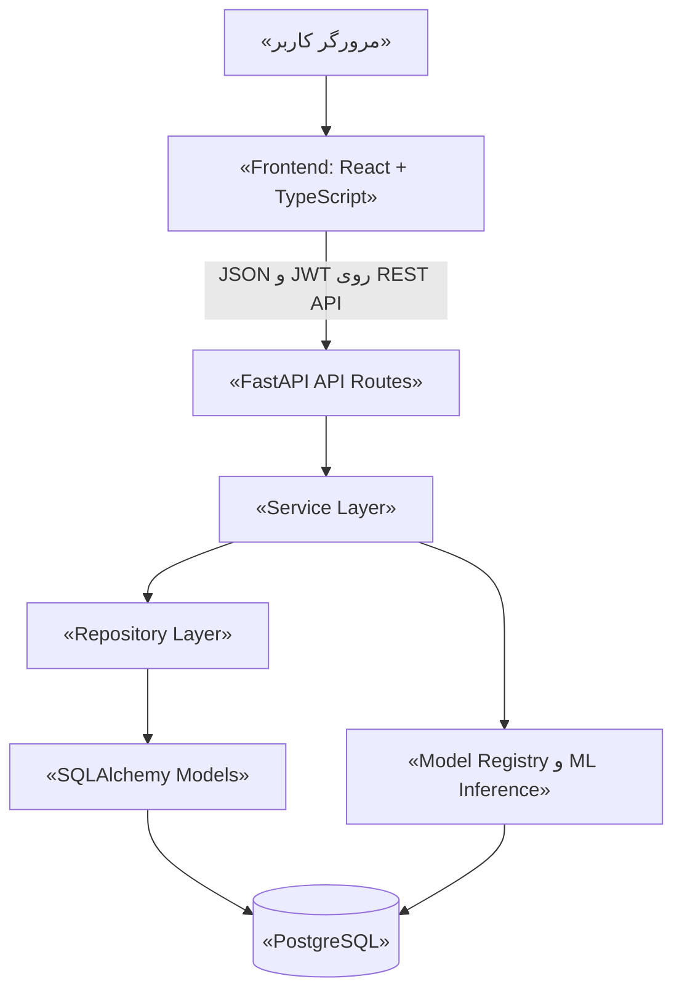
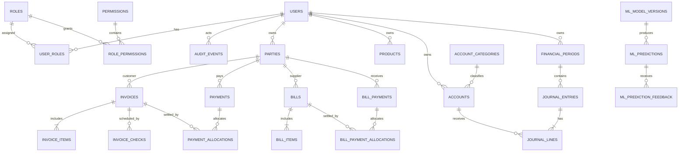
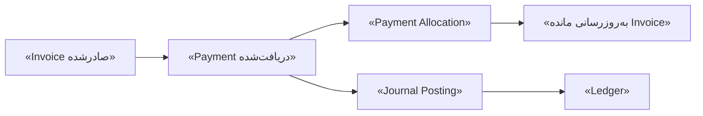
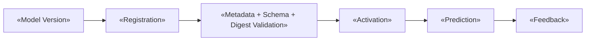
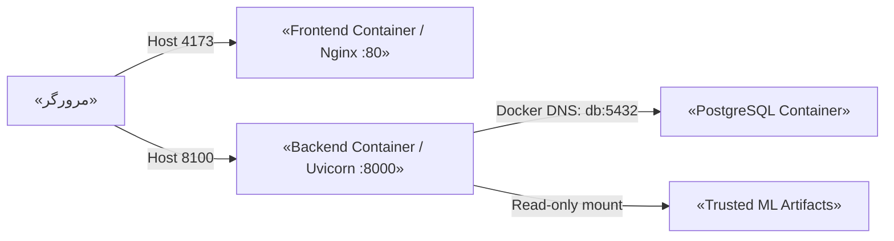

# ارائه دانشگاهی پروژه Azari Intelligent Accounting

## ۱. معرفی پروژه

**نام پروژه:** Azari Intelligent Accounting

**نوع پروژه:** سامانه وب حسابداری هوشمند با معماری چندلایه، پایگاه داده رابطه‌ای و ابزارهای یادگیری ماشین

**زبان اصلی رابط کاربری:** فارسی با چیدمان راست‌به‌چپ

**هدف اصلی:** ثبت عملیات مالی کسب‌وکار، تولید گزارش‌های قابل تطبیق با دفتر کل و ارائه ابزارهای هوشمند برای کمک به تصمیم‌گیری

Azari Intelligent Accounting یک پروژه تمام‌پشته (Full-stack) است. کاربر می‌تواند اطلاعات پایه مانند مشتری، تأمین‌کننده، کالا یا خدمت، حساب‌ها و دوره‌های مالی را تعریف کند؛ سپس فاکتور فروش، صورتحساب خرید، دریافت از مشتری، پرداخت به تأمین‌کننده و سند حسابداری را ثبت کند. بخش گزارش‌گیری داده‌های قطعی‌شده را به گزارش‌های مالی تبدیل می‌کند و بخش یادگیری ماشین، بدون تغییر دادن دفتر کل، تحلیل‌هایی مانند طبقه‌بندی شرح تراکنش، ریسک تأخیر پرداخت، پیش‌بینی جریان نقدی و بخش‌بندی مشتریان ارائه می‌دهد.

این سامانه برای کسب‌وکارهای فارسی‌زبان طراحی شده است. رابط فارسی، نمایش راست‌به‌چپ، پشتیبانی نمایشی از تاریخ شمسی و میلادی، قالب‌بندی مبالغ ریالی و طراحی واکنش‌گرا، استفاده از آن را برای کاربری که الزاماً توسعه‌دهنده یا متخصص زیرساخت نیست ساده‌تر می‌کند.

> **نکته صداقت علمی:** این پروژه یک پایه عملی و قابل اجرا برای حسابداری و تحلیل هوشمند است، اما یک ERP کامل یا محصول آماده استقرار در تمام محیط‌های تجاری نیست. محدودیت‌های واقعی آن در بخش «محدودیت‌ها و کارهای آینده» بیان شده‌اند.

## ۲. مسئله‌ای که پروژه حل می‌کند

کسب‌وکارهای کوچک و متوسط معمولاً با چند مسئله هم‌زمان روبه‌رو هستند:

- اطلاعات مشتری، فاکتور، چک، دریافت و مانده حساب در فایل‌ها یا ابزارهای جداگانه نگهداری می‌شود.
- یک ثبت اشتباه می‌تواند باعث اختلاف میان فاکتور، مانده مشتری و دفتر کل شود.
- گزارش دستی زمان‌بر است و احتمال خطای انسانی دارد.
- مدیر برای تشخیص مشتریان پرریسک، روند جریان نقدی یا الگوی رفتار مشتریان ابزار تحلیلی منسجمی ندارد.
- دسترسی همه کاربران نباید یکسان باشد و هر کاربر باید فقط داده‌های فضای کاری خود را ببیند.

پروژه برای حل این مسائل، سه حوزه را کنار هم قرار می‌دهد:

1. **حسابداری (Accounting):** منبع قطعی حقیقت مالی؛ شامل سند دوطرفه، بدهکار، بستانکار، دوره مالی، فاکتور و پرداخت.
2. **اتوماسیون نرم‌افزاری:** محاسبه مبالغ در Backend، کنترل قواعد، ثبت اتمیک تراکنش و تولید خودکار سند از عملیات تجاری.
3. **هوش مصنوعی (AI/ML):** ابزار پشتیبان تصمیم؛ خروجی احتمالی و تحلیلی تولید می‌کند، اما اجازه ندارد مانده حساب، فاکتور یا سند دفتر کل را تغییر دهد.

بنابراین تفاوت بنیادی بخش حسابداری و بخش هوش مصنوعی چنین است:

| بخش | ماهیت خروجی | اثر مستقیم بر دفتر کل |
|---|---|---|
| حسابداری | مبلغ و وضعیت قطعی مبتنی بر قواعد | دارد؛ فقط پس از ثبت قطعی |
| هوش مصنوعی | پیش‌بینی، امتیاز، طبقه یا خوشه | ندارد |

## ۳. معماری کلان سامانه

معماری اصلی پروژه به‌صورت زیر است:



مسیر ساده‌شده داده همان زنجیره زیر است:

```text
Frontend
   ↓
REST API
   ↓
Backend / Services
   ↓
Repositories / Database Models
   ↓
PostgreSQL
```

بخش ML نیز جریان مستقل زیر را دارد:

```text
Accounting Data یا متن ورودی
            ↓
Feature Processing
            ↓
Active ML Model
            ↓
Prediction
            ↓
ثبت تاریخچه Prediction و API Response
```

### چرا معماری چندلایه انتخاب شده است؟

این تفکیک باعث می‌شود مسئولیت هر بخش روشن باشد:

- رابط API فقط قرارداد HTTP، احراز هویت، مجوز و تبدیل خطا را مدیریت می‌کند.
- Service قواعد تجاری و مرز تراکنش را در اختیار دارد.
- Repository پرس‌وجو و جداسازی داده هر مالک را متمرکز می‌کند.
- Model ساختار پایگاه داده، رابطه‌ها و قیود را مشخص می‌کند.
- تغییر رابط کاربری، منطق حسابداری را مستقیماً تغییر نمی‌دهد.
- قواعد حساس را می‌توان مستقل از صفحه وب آزمود.

## ۴. فناوری‌های استفاده‌شده

| فناوری | کاربرد واقعی در پروژه | دلیل استفاده |
|---|---|---|
| Python 3.12 | Backend و Pipelineهای ML | خوانایی، اکوسیستم داده و پشتیبانی مناسب از Type Hint |
| FastAPI | REST API، Dependency Injection و مستندات توسعه | قراردادهای روشن و سازگاری مناسب با Pydantic |
| Pydantic / Pydantic Settings | اعتبارسنجی Request و تنظیمات محیط | جلوگیری از ورود داده نامعتبر و مدیریت تنظیمات تایپ‌شده |
| SQLAlchemy 2 | ORM، Query و تراکنش | مدل‌سازی رابطه‌ای و کنترل صریح Session |
| Alembic | نسخه‌بندی Schema | ارتقا و بازگردانی کنترل‌شده پایگاه داده |
| PostgreSQL 16 | پایگاه داده اصلی | تراکنش ACID، قفل سطری، قیود و Queryهای گزارش‌گیری |
| Psycopg | Driver اتصال Python به PostgreSQL | ارتباط Backend با پایگاه داده |
| Argon2id | Hash کردن Password | نگهداری نکردن گذرواژه به‌صورت متن ساده |
| PyJWT و JWT Bearer Token | Session بدون وضعیت سمت سرور | حمل شناسه کاربر با زمان انقضا و امضای HMAC |
| React 19 | رابط کاربری Component-based | ساخت صفحات و فرم‌های تعاملی |
| TypeScript 5.8 | تایپ ایستای Frontend | کاهش خطا در قرارداد داده و Componentها |
| Vite 6 | Build و محیط توسعه Frontend | Build سریع و خروجی Production |
| Vazirmatn | فونت فارسی Self-hosted | خوانایی فارسی بدون وابستگی به CDN |
| NumPy و Pandas | پردازش داده ML | محاسبات عددی و آماده‌سازی DataFrame |
| Scikit-learn | مدل‌های طبقه‌بندی، رگرسیون و خوشه‌بندی | الگوریتم‌های استاندارد و قابل آزمون |
| TF-IDF | تبدیل متن به ویژگی عددی | وزن‌دهی واژه‌ها و عبارت‌های یک‌واژه‌ای/دوواژه‌ای |
| Multinomial Naive Bayes | نامزد طبقه‌بندی متن | مدل پایه مناسب برای ویژگی‌های متنی پراکنده |
| Linear SVM کالیبره‌شده | نامزد دوم طبقه‌بندی متن | مقایسه مدل خطی قوی و تولید احتمال کالیبره‌شده |
| Random Forest | پیش‌بینی ریسک تأخیر پرداخت | مدل‌سازی رابطه‌های غیرخطی در ویژگی‌های رفتاری |
| Linear Regression هارمونیک | پیش‌بینی جریان نقدی | مدل قطعی سبک با روند و مؤلفه‌های دوره‌ای |
| K-Means و StandardScaler | بخش‌بندی مشتریان | خوشه‌بندی رفتارهای عددی پس از هم‌مقیاس‌سازی |
| Joblib | ذخیره Artifact مدل | Serialization مدل‌های Scikit-learn |
| Docker و Docker Compose | اجرای قابل تکرار سه سرویس | کاهش تفاوت محیط توسعه و اجرا |
| Nginx | سرو فایل‌های Buildشده Frontend | وب‌سرور سبک، fallback مسیرهای SPA و Headerهای امنیتی |

در کد فعلی **Prophet نصب نشده است**. پیش‌بینی جریان نقدی عمداً از یک رگرسیون خطی هارمونیک به‌عنوان جایگزین سبک و قطعی Prophet استفاده می‌کند.

## ۵. ساختار Backend

### ۵.۱. API Routes

Routeها ورودی HTTP را دریافت می‌کنند، Dependency مربوط به JWT و Permission را اجرا می‌کنند، داده را با Schema اعتبارسنجی می‌کنند و سپس Service مناسب را فرا می‌خوانند. مسیرهای اصلی زیر پیشوند `/api/v1` دارند:

- احراز هویت: ثبت‌نام، ورود و اطلاعات کاربر جاری
- مدیریت کاربران: فهرست، جزئیات، تغییر نقش و فعال/غیرفعال‌سازی
- اطلاعات پایه: طرف حساب، کالا/خدمت، سرفصل حساب، حساب و دوره مالی
- عملیات: سند، فاکتور فروش، چک فاکتور، دریافت، صورتحساب خرید و پرداخت به تأمین‌کننده
- گزارش‌ها و داشبورد
- ثبت نسخه مدل، فعال‌سازی، پیش‌بینی، تاریخچه و بازخورد ML
- `/health` برای زنده‌بودن Process و `/ready` برای آمادگی همراه با اتصال پایگاه داده

Route نباید مبلغ نهایی حسابداری را از Frontend بپذیرد و به آن اعتماد کند؛ محاسبه و قاعده تجاری در Service انجام می‌شود.

### ۵.۲. Services

Service Layer مرکز قواعد سامانه است. نمونه مسئولیت‌های آن:

- محاسبه مبلغ هر ردیف و جمع فاکتور با `Decimal`
- کنترل فعال بودن مشتری، تأمین‌کننده، کالا، حساب و دوره
- کنترل نقش معنایی حساب، مانند `RECEIVABLE` یا `TAX_LIABILITY`
- ساخت سند خودکار هنگام صدور فاکتور یا ثبت پرداخت
- اجرای چند تغییر مرتبط در یک تراکنش و Rollback در صورت خطا
- قفل کردن سطرهای حساس با `SELECT ... FOR UPDATE`
- ثبت Audit Event برای عملیات مهم
- بارگذاری مدل فعال و ثبت Prediction

### ۵.۳. Repositories

Repositoryها دسترسی به داده را متمرکز می‌کنند. در دامنه حسابداری، Queryهای `get` و `list` علاوه بر شناسه رکورد، `owner_id` کاربر جاری را نیز بررسی می‌کنند. نتیجه این طراحی آن است که هر کاربر ثبت‌نام‌شده فقط مشتریان، حساب‌ها، فاکتورها و سایر داده‌های حسابداری متعلق به فضای کاری خود را مشاهده می‌کند.

Repository گزارش‌گیری Queryهای تجمیعی روی اسناد `POSTED`، فاکتورهای صادرشده و پرداخت‌های ثبت‌شده را اجرا می‌کند. Repository بخش ML نیز مدل‌ها، پیش‌بینی‌ها و بازخوردها را مدیریت می‌کند؛ تاریخچه پیش‌بینی برای درخواست‌کننده فیلتر می‌شود.

### ۵.۴. Database Models

Modelها جدول، ستون، Foreign Key، Unique Constraint، Check Constraint و Relationship را تعریف می‌کنند. شناسه‌های اصلی UUID هستند. مبالغ با `Numeric(18,2)` و تعداد با `Numeric(18,4)` ذخیره می‌شوند تا خطای محاسبات ممیز شناور وارد حسابداری نشود.

### ۵.۵. مزیت این زنجیره

```text
API Routes
    ↓
Services
    ↓
Repositories
    ↓
Database Models
    ↓
PostgreSQL
```

این ساختار، تست‌پذیری، جداسازی مسئولیت، جلوگیری از تکرار Query و حفظ قواعد حسابداری در یک نقطه معتبر را فراهم می‌کند.

## ۶. طراحی پایگاه داده

Metadata فعلی SQLAlchemy شامل **۲۵ جدول برنامه** است. PostgreSQL همچنین جدول فنی `alembic_version` را برای ثبت نسخه Migration نگه می‌دارد.

### ۶.۱. هویت، نقش و ممیزی

| جدول | نقش |
|---|---|
| `users` | ایمیل یا شماره تلفن، Hash گذرواژه، نام، وضعیت، زمان آخرین ورود و `plan_status` |
| `roles` | تعریف نقش‌هایی مانند ADMIN و OWNER |
| `permissions` | تعریف مجوزهای جزئی مانند `invoices:issue` |
| `user_roles` | رابطه چندبه‌چند کاربر و نقش |
| `role_permissions` | رابطه چندبه‌چند نقش و مجوز |
| `audit_events` | ثبت رویدادهای مهم هویتی، حسابداری و ML |

ایمیل و شماره تلفن غیرتهی یکتا هستند و حداقل یکی از آن‌ها برای User لازم است. `plan_status` در حال حاضر فقط `FREE` یا `PRO` را می‌پذیرد، اما در نسخه فعلی هیچ منطق پرداخت یا محدودسازی قابلیت بر اساس Plan وجود ندارد.

### ۶.۲. اطلاعات پایه و دفتر کل

| جدول | نقش |
|---|---|
| `parties` | مشتری، تأمین‌کننده یا هر دو |
| `products` | کالا/خدمت اختیاری با SKU و قیمت پایه |
| `account_categories` | گروه حساب و نوع اصلی آن |
| `accounts` | حساب دفتر کل، کد، والد و نقش ثبت |
| `financial_periods` | بازه‌های مجاز ثبت با وضعیت OPEN/CLOSED |
| `journal_entries` | سرآیند سند حسابداری |
| `journal_lines` | ردیف‌های بدهکار یا بستانکار سند |

بیشتر جدول‌های تجاری دارای `owner_id` هستند. Unique Constraintهای مهم مانند شماره فاکتور، شماره صورتحساب خرید، کد حساب و SKU در محدوده همان مالک اعمال می‌شوند.

### ۶.۳. فروش، دریافت و چک

| جدول | نقش |
|---|---|
| `invoices` | فاکتور فروش، مشتری، وضعیت و جمع مبالغ |
| `invoice_items` | اقلام، تعداد، قیمت، مالیات و مبلغ ردیف |
| `invoice_checks` | مبلغ، شناسه صیادی اختیاری، سررسید و وضعیت هر چک |
| `payments` | دریافت از مشتری |
| `payment_allocations` | تخصیص بخشی از دریافت به یک یا چند فاکتور |

جمع چک‌ها الزاماً برابر مبلغ فاکتور نیست. اگر مبلغ وصول‌شده کمتر باشد، مانده دریافتنی مشتری باقی می‌ماند؛ اگر بیشتر باشد، بخش اضافه در حساب بدهی با نقش `CUSTOMER_CREDIT` ثبت می‌شود و نشان می‌دهد کسب‌وکار به مشتری بدهکار است.

### ۶.۴. خرید و پرداختنی‌ها

| جدول | نقش |
|---|---|
| `bills` | صورتحساب خرید از تأمین‌کننده |
| `bill_items` | اقلام صورتحساب خرید |
| `bill_payments` | پرداخت خروجی به تأمین‌کننده |
| `bill_payment_allocations` | تخصیص پرداخت به صورتحساب‌های خرید |

در تصمیم تجاری فعلی، مالیات خرید **غیرقابل بازیافت** است: هنگام صدور Bill، کل مبلغ شامل مالیات بدهکار حساب `EXPENSE` و همان کل مبلغ بستانکار حساب `PAYABLE` می‌شود.

### ۶.۵. یادگیری ماشین

| جدول | نقش |
|---|---|
| `ml_model_versions` | نسخه، Pipeline، Fingerprint داده، Feature Schema، Metric، Dependency، Digest و وضعیت فعال |
| `ml_predictions` | خروجی پیش‌بینی، Confidence، توضیح، منبع، مدل و درخواست‌کننده |
| `ml_prediction_feedback` | نتیجه واقعی، اصلاح یا توضیح کاربر برای Prediction |

یک Partial Unique Index تضمین می‌کند برای هر Pipeline فقط یک مدل فعال وجود داشته باشد.
`ml_model_versions` برخلاف جدول‌های حسابداری `owner_id` ندارد؛ بنابراین Registry و مدل فعال در سطح کل برنامه مشترک‌اند. در مقابل، تاریخچه Prediction با `requested_by_id` به درخواست‌کننده محدود می‌شود. مدیریت Registry با Permission کنترل می‌شود، نه با مالکیت فضای حسابداری.

### ۶.۶. نمودار ساده روابط



برای خوانایی، تمام `owner_id`ها و رابطه اختیاری فاکتور/Bill/Payment با سند خودکار در نمودار نشان داده نشده‌اند.

## ۷. مفاهیم و منطق حسابداری

### ۷.۱. Chart of Accounts و Account Categories

Chart of Accounts فهرست ساختاریافته حساب‌های دفتر کل است. هر Account کد، نام، سرفصل، والد اختیاری و وضعیت فعال دارد. سرفصل حساب یکی از نوع‌های زیر است:

- `ASSET` — دارایی
- `LIABILITY` — بدهی
- `EQUITY` — حقوق مالکانه
- `REVENUE` — درآمد
- `EXPENSE` — هزینه

علاوه بر نوع کلی، `posting_role` مقصد معنایی ثبت را مشخص می‌کند: `GENERAL`، `CASH`، `RECEIVABLE`، `REVENUE`، `TAX_LIABILITY`، `PAYABLE`، `EXPENSE` و `CUSTOMER_CREDIT`.

این نقش معنایی مهم است؛ برای مثال هر حساب ASSET الزاماً حساب دریافتنی تجاری نیست. صدور فاکتور فقط حساب ASSET دارای نقش `RECEIVABLE` را می‌پذیرد. پس از آنکه یک حساب در سند `POSTED` استفاده شد، Service اجازه تغییر سرفصل یا نقش ثبت آن را نمی‌دهد تا گزارش تاریخی بازنویسی نشود.

### ۷.۲. دوره مالی

Financial Period بازه مجاز ثبت سند است. دوره‌ها نباید هم‌پوشانی داشته باشند. سند فقط وقتی قطعی می‌شود که تاریخ آن داخل دوره و وضعیت دوره `OPEN` باشد. بستن دوره و ثبت سند، سطر دوره را قفل می‌کنند تا رقابت هم‌زمان نتواند ثبت را وارد دوره بسته کند.

### ۷.۳. Journal Entry، Journal Line، Debit و Credit

Journal Entry سرآیند سند و Journal Line اثر هر حساب است. هر ردیف دقیقاً باید یکی از دو سمت مثبت را داشته باشد:

- **Debit (بدهکار):** در این پروژه افزایش معمول دارایی و هزینه در این سمت نمایش داده می‌شود.
- **Credit (بستانکار):** افزایش معمول بدهی، حقوق مالکانه و درآمد در این سمت نمایش داده می‌شود.

در حسابداری دوطرفه (Double-entry Accounting)، هر رویداد حداقل دو اثر دارد و قانون اصلی این است:

```text
Total Debit = Total Credit
```

Service پیش از `POSTED` شدن سند، وجود حداقل دو ردیف، فعال بودن حساب‌ها، یک‌طرفه بودن هر ردیف، مثبت بودن مبلغ و برابری جمع بدهکار و بستانکار را بررسی می‌کند. قیدهای پایگاه داده نیز منفی نبودن و یک‌طرفه بودن هر ردیف را کنترل می‌کنند. برابری کل سند در Service اعمال می‌شود.

اهمیت این توازن آن است که معادله حسابداری حفظ شود و Trial Balance بتواند اختلاف ثبت را آشکار کند.

### ۷.۴. مثال مرحله‌ای فروش

فرض کنیم یک خدمت با مبلغ ۱۰۰ و مالیات ۱۰ فروخته می‌شود:

1. کاربر مشتری را انتخاب می‌کند یا نام مشتری را می‌نویسد؛ در حالت نام جدید، Backend یک Party مشتری در فضای همان کاربر می‌سازد.
2. کاربر شرح کالا/خدمت را می‌نویسد؛ Product از نظر API اختیاری است.
3. یک Invoice با حداقل یک Invoice Item ایجاد می‌شود.
4. Backend مبلغ ردیف، `subtotal=100`، `tax=10` و `total=110` را محاسبه می‌کند.
5. Invoice ابتدا `DRAFT` است و هیچ اثری بر دفتر کل، درآمد، دریافتنی یا داشبورد مالی ندارد.
6. برای Issue، حساب‌های فعال و متمایز `RECEIVABLE`، `REVENUE` و برای مالیات، `TAX_LIABILITY` انتخاب می‌شوند.
7. Backend یک Journal Entry ایجاد می‌کند:

```text
Debit  RECEIVABLE       110
Credit REVENUE          100
Credit TAX_LIABILITY     10
```

8. سند در دوره باز `POSTED` و Invoice برابر `ISSUED` می‌شود.
9. گزارش‌های دفتر کل و دریافتنی‌ها فقط پس از این مرحله تغییر می‌کنند.

Draft باید قابل بررسی باشد و ممکن است هنوز اصلاح شود؛ بنابراین شناسایی درآمد یا طلب در مرحله Draft، رقم‌های مالی را بدون تعهد قطعی افزایش می‌دهد. کد فعلی این نقص را اصلاح کرده و Query دریافتنی فقط وضعیت‌های صادرشده/پرداخت‌شده را در نظر می‌گیرد.

### ۷.۵. دریافت، تخصیص و مانده مشتری



در ثبت عادی دریافت:

- حساب `CASH` بدهکار می‌شود.
- به اندازه مبلغ تخصیص، حساب `RECEIVABLE` بستانکار می‌شود.
- اگر دریافت از جمع تخصیص بیشتر باشد، اضافه آن به حساب بدهی `CUSTOMER_CREDIT` بستانکار می‌شود.
- Invoice پس از پرداخت جزئی `PARTIALLY_PAID` و پس از تسویه `PAID` می‌شود.

نمونه: اگر مبلغ فاکتور ۹۰۰ و چک وصول‌شده ۱۰۰۰ باشد، ۹۰۰ طلب تسویه و ۱۰۰ بدهی کسب‌وکار به مشتری ثبت می‌شود. اگر چک ۸۰۰ باشد، ۸۰۰ تخصیص می‌یابد و ۱۰۰ دریافتنی مشتری باقی می‌ماند.

برای جلوگیری از بیش‌تخصیص:

- تخصیص باید به فاکتور همان مشتری و در وضعیت معتبر تعلق داشته باشد.
- مبلغ تخصیص از مانده جاری بیشتر نمی‌شود.
- هنگام Post، Payment و تمام Invoiceهای هدف با قفل سطری PostgreSQL خوانده و دوباره اعتبارسنجی می‌شوند.
- شناسه Invoiceها با ترتیب ثابت قفل می‌شود تا احتمال Deadlock کاهش یابد.
- ساخت سند، تغییر Payment و تغییر مانده Invoice در یک Transaction انجام می‌شود؛ خطا همه تغییرها را Rollback می‌کند.
- حساب دریافتنی Payment باید همان حساب دریافتنی سند Invoice باشد تا Subledger و Ledger از هم جدا نشوند.

### ۷.۶. چک‌های فاکتور

برای فاکتور با روش `CHECK`، یک یا چند چک با مبلغ، سررسید، وضعیت و شناسه صیادی اختیاری ذخیره می‌شود. وضعیت‌ها `PENDING`، `CLEARED` و `BOUNCED` هستند. صرف ثبت چک پول را وارد حساب نمی‌کند. هنگام `CLEARED` شدن، Backend یک Payment و سند مربوط به وصول ایجاد می‌کند. چک وصول‌شده پس از آن تغییرناپذیر است تا وصول دوباره ثبت نشود.

### ۷.۷. خرید و پرداخت به تأمین‌کننده

Bill نیز ابتدا Draft است. در زمان Issue:

```text
Debit  EXPENSE    bill.total
Credit PAYABLE    bill.total
```

مالیات خرید جدا نمی‌شود و در کل هزینه جذب می‌شود. هنگام پرداخت به تأمین‌کننده:

```text
Debit  PAYABLE    payment.amount
Credit CASH       payment.amount
```

تخصیص Bill Payment باید دقیقاً برابر مبلغ پرداخت باشد. Billها نیز در زمان Post با قفل سطری و اعتبارسنجی مجدد محافظت می‌شوند.

### ۷.۸. برگشت سند

سند دستی `POSTED` و ردیف‌های اصلی آن تغییر نمی‌کنند. Reverse یک سند جدا با بدهکار و بستانکار معکوس می‌سازد. Reverse تکراری، Reverse کردن خود سند معکوس و Reverse مستقیم سند تولیدشده از Invoice، Payment، Bill یا Bill Payment ممنوع است. چون سند معکوس با تاریخ سند اصلی ساخته می‌شود، اگر دوره بسته باشد ثبت آن رد می‌شود؛ در نسخه فعلی Workflow انتخاب تاریخ جایگزین در یک دوره باز وجود ندارد.

## ۸. Authentication، Authorization و RBAC

### ۸.۱. ثبت‌نام و ورود

کاربر می‌تواند با ایمیل، شماره تلفن E.164 یا هر دو ثبت‌نام کند و با ایمیل یا تلفن وارد شود. حداقل یکی از دو شناسه لازم است. Email نرمال‌سازی و شماره تلفن از نظر قالب اعتبارسنجی می‌شود.

Password هیچ‌گاه به‌صورت متن ساده در جدول User ذخیره نمی‌شود؛ `argon2-cffi` آن را با Argon2id Hash می‌کند. در Login، Hash بررسی و سپس JWT Access Token صادر می‌شود. Token شامل شناسه User، نوع Token، زمان صدور، زمان انقضا و شناسه یکتای `jti` است و با الگوریتم HMAC SHA-2 مجاز امضا می‌شود.

Frontend توکن را در `sessionStorage` نگه می‌دارد و در Header زیر می‌فرستد:

```text
Authorization: Bearer <access-token>
```

Backend در هر درخواست محافظت‌شده امضا، انقضا، Claimهای لازم، وجود User و فعال بودن آن را بررسی می‌کند.

### ۸.۲. نقش‌ها

| نقش | دسترسی واقعی |
|---|---|
| `ADMIN` | تمام Permissionها، از جمله مدیریت کاربران و نقش‌ها |
| `OWNER` | تمام عملیات فضای کاری شخصی، گزارش و ML؛ بدون هیچ `users:*` |
| `ACCOUNTANT` | عملیات کامل حسابداری و دسترسی‌های مشخص ML، بدون مدیریت کاربران |
| `MANAGER` | مشاهده حسابداری و گزارش، مشاهده کاربران و برخی تحلیل‌های ML؛ بدون ثبت حسابداری |
| `VIEWER` | مشاهده خواندنی حسابداری، گزارش و نتایج ML |

ثبت‌نام عمومی همیشه نقش Server-selected `OWNER` می‌دهد و Client نمی‌تواند نقش ADMIN تزریق کند. ADMIN واقعی از مسیر Bootstrap کنترل‌شده ایجاد می‌شود. منطق مدیریت کاربران اجازه نمی‌دهد آخرین ADMIN فعال حذف نقش یا غیرفعال شود و ADMIN نمی‌تواند خودش را غیرفعال کند.

### ۸.۳. Permissionها

Permissionها جزئی و عملیاتی هستند؛ برای نمونه:

- `parties:read` و `parties:write`
- `journals:write` و `journals:post`
- `invoices:write` و `invoices:issue`
- `payments:write` و `payments:post`
- `bills:issue` و `bill_payments:post`
- `reports:read`
- `ml:predict`، `ml:manage` و `ml:feedback`
- `users:read` و `users:manage`

Frontend گزینه غیرمجاز را پنهان می‌کند، ولی مرز امنیت واقعی Dependencyهای Backend هستند. نبود Permission پاسخ HTTP 403 ایجاد می‌کند.

### ۸.۴. جداسازی فضای کاری

نقش اجازه انجام یک نوع عملیات را مشخص می‌کند؛ `owner_id` مشخص می‌کند عملیات روی داده چه کسی انجام شود. بیشتر داده‌های حسابداری با شناسه User جاری ساخته می‌شوند و Repository همان شرط را در خواندن اعمال می‌کند. بنابراین دانستن UUID رکورد کاربر دیگر برای دسترسی به آن کافی نیست.

### ۸.۵. Audit Event

Audit Event یک رویداد Append-oriented شامل Actor، Action، نوع و شناسه منبع، زمان، موفقیت و Metadata است. رویدادهایی مانند ثبت‌نام، ورود، تغییر نقش، تغییر وضعیت User، ساخت/ثبت عملیات حسابداری، ثبت و فعال‌سازی مدل و ارسال Feedback ثبت می‌شوند.

Repository ممیزی کلیدهای حساس را به‌صورت بازگشتی بررسی می‌کند و ذخیره مواردی مانند `password`، `password_hash`، `token`، `jwt_secret`، `authorization` و `credentials` را رد می‌کند. گذرواژه، Token و Secret نباید در Audit، Log یا پاسخ خطا ذخیره شوند. برخی شناسه‌های لازم برای بررسی رخداد، مانند Email در تلاش ثبت‌نام تکراری یا نوع شناسه ورود ناموفق، ممکن است در Metadata عملیاتی ثبت شوند؛ بنابراین دسترسی به جدول Audit نیز باید کنترل‌شده باشد.

## ۹. گزارش‌گیری

گزارش‌ها Read-only هستند و Query آنها داده حسابداری را تغییر نمی‌دهد.

### ۹.۱. Trial Balance — تراز آزمایشی

برای هر حساب، جمع Debit، جمع Credit و Balance را از Journal Entryهای `POSTED` در بازه تاریخ محاسبه می‌کند. در پایان `total_debit` و `total_credit` و وضعیت `balanced` را نشان می‌دهد. این گزارش نخستین کنترل برای کشف عدم توازن دفتر کل است.

### ۹.۲. Income Statement — صورت سود و زیان

فقط حساب‌های نوع `REVENUE` و `EXPENSE` را از اسناد قطعی جمع می‌کند. درآمد، هزینه و `net_income = revenue - expense` را نمایش می‌دهد. این گزارش عملکرد اقتصادی کسب‌وکار در یک دوره را نشان می‌دهد.

### ۹.۳. Revenue Report — گزارش درآمد

فعالیت حساب‌های نوع REVENUE را به تفکیک حساب و بازه تاریخ نمایش می‌دهد. منبع آن Journal Lineهای اسناد قطعی است، نه صرفاً فهرست فاکتورها؛ در نتیجه با دفتر کل قابل تطبیق است.

### ۹.۴. Expense Report — گزارش هزینه

فعالیت حساب‌های EXPENSE را نمایش می‌دهد. صورتحساب خرید صادرشده، کل مبلغ خود شامل مالیات غیرقابل بازیافت را وارد این حساب‌ها می‌کند.

### ۹.۵. Balance Sheet — ترازنامه

مانده Asset، Liability و Equity را تا تاریخ `as_of` محاسبه می‌کند و سود جاری را از Revenue منهای Expense به سمت بدهی و حقوق مالکانه اضافه می‌کند. سپس برابری دارایی با مجموع بدهی، حقوق مالکانه و سود جاری را اعلام می‌کند.

### ۹.۶. Receivables — مطالبات

Invoiceهای صادرشده، پرداخت جزئی و پرداخت‌شده را تا تاریخ گزارش بررسی می‌کند و فقط مواردی را که در آن تاریخ مانده دارند نشان می‌دهد. Payment Allocationهای `POSTED` تا همان تاریخ از مبلغ Invoice کم می‌شوند. مبلغ مانده، مبلغ سررسیدگذشته و تعداد روز تأخیر برای پیگیری وصول مهم‌اند. Draft در این گزارش وارد نمی‌شود.

### ۹.۷. Payables — پرداختنی‌ها

برای Billهای صادرشده، Allocation پرداخت‌های خروجی قطعی را کم می‌کند و مانده بدهی به تأمین‌کننده، سررسید و تأخیر را نشان می‌دهد. این قابلیت در نسخه فعلی واقعاً پیاده‌سازی شده است.

### ۹.۸. Cash Flow — جریان نقدی

Paymentهای مشتری را به‌عنوان Inflow و Bill Paymentهای تأمین‌کننده را به‌عنوان Outflow، بر اساس تاریخ و فقط در وضعیت `POSTED` تجمیع می‌کند. خروجی روزانه و جمع ورودی، خروجی و خالص جریان نقدی را ارائه می‌دهد.

### ۹.۹. Party History — گردش مشتری

اطلاعات مشتری، تعداد خرید، مجموع خرید، مجموع دریافت، مانده دریافتنی، اعتبار مشتری، خالص مانده، ریز Invoice و Item، چک‌ها، Paymentها و Timeline تراکنش‌ها را نمایش می‌دهد. جهت مانده یکی از حالت‌های زیر است:

- `CUSTOMER_OWES`: مشتری به کسب‌وکار بدهکار است.
- `BUSINESS_OWES`: کسب‌وکار به مشتری بدهکار است.
- `SETTLED`: مانده خالص صفر است.

تاریخچه عملیاتی می‌تواند رکوردهای وضعیت‌های مختلف را نمایش دهد، درحالی‌که جمع مالی مشتری بر Invoiceهای صادرشده و Paymentهای قطعی تکیه دارد.

### ۹.۱۰. Dashboard

Dashboard خروجی چند گزارش را خلاصه می‌کند: درآمد، هزینه، سود خالص، جریان نقدی خالص، مطالبات، مطالبات سررسیدگذشته و تعداد Invoiceهای باز/معوق. مشاهده یا Refresh صفحه هیچ Record جدیدی ایجاد نمی‌کند.

## ۱۰. یادگیری ماشین و هوش مصنوعی

### ۱۰.۱. مرز علمی بخش ML

چهار Pipeline پروژه با Generatorهای قطعی و نویزی **داده مصنوعی (Synthetic Data)** آموزش داده می‌شوند. Metadata هر Artifact نیز `synthetic_data` را ثبت می‌کند و Frontend آن را «مصنوعی/آزمایشی» نمایش می‌دهد. Metricهای این مدل‌ها فقط برای آزمون Pipeline و مقایسه در همان داده مصنوعی معتبرند؛ از آنها نمی‌توان دقت واقعی بازار، عدالت مدل یا سود تجاری را نتیجه گرفت.

### ۱۰.۲. طبقه‌بندی شرح تراکنش

**ورودی:** متن شرح تراکنش

**پردازش:** `TfidfVectorizer` با Unigram و Bigram

**نامزدها:** Multinomial Naive Bayes و Linear SVM کالیبره‌شده

**خروجی:** Category، Confidence، نیاز به بازبینی و نسخه مدل

TF-IDF واژه‌ای را مهم‌تر می‌کند که در آن متن پرتکرار ولی در کل اسناد کمتر رایج باشد. Multinomial Naive Bayes یک مدل احتمالی مناسب داده متنی پراکنده است. Linear SVM مرز خطی میان گروه‌ها می‌سازد؛ چون SVM پایه احتمال مستقیم نمی‌دهد، پروژه آن را با `CalibratedClassifierCV` کالیبره کرده است. دو مدل روی Test Set مقایسه می‌شوند و مدل دارای Macro F1 بهتر و سپس Accuracy بهتر انتخاب می‌شود.

اگر Confidence از آستانه برنامه کمتر باشد، Prediction با `review_required` علامت می‌خورد؛ سیستم نباید طبقه کم‌اطمینان را به‌عنوان تصمیم قطعی حسابداری تلقی کند.

### ۱۰.۳. ریسک تأخیر پرداخت

**مدل:** `RandomForestClassifier`

**هدف:** تخمین احتمال دیرکرد Invoice صادرشده و دارای مانده

**ویژگی‌ها:** مبلغ جاری، تعداد و میانگین مبلغ Invoiceهای قبلی، میانگین تأخیر، نرخ دیرکرد، مبلغ پرداخت‌شده پیشین، فراوانی Invoice/Payment، مانده در لحظه پیش‌بینی و سابقه مشتری

تقسیم داده بر اساس زمان و به نسبت تقریبی ۷۰٪ آموزش، ۱۵٪ اعتبارسنجی و ۱۵٪ آزمون انجام می‌شود. اهمیت جلوگیری از Data Leakage در این Pipeline بسیار زیاد است: اگر پرداخت آینده هنگام پیش‌بینی یک Invoice قدیمی وارد Feature شود، مدل پاسخ آینده را از قبل دیده است و Metric غیرواقعی می‌شود. Feature Builder فقط تاریخچه‌ای را کامل‌شده می‌داند که Payment آن قبل از `prediction_time` باشد. Service آنلاین نیز Queryها را با `as_of` و `owner_id` محدود می‌کند.

خروجی شامل احتمال، طبقه `high/low` و چند Signal است. Signalها Contribution دقیق علّی یا SHAP نیستند؛ خود کد دامنه توضیح را `model-level heuristic` معرفی می‌کند.

### ۱۰.۴. پیش‌بینی جریان نقدی

Cash Flow Forecast مقدار آینده را برای تعداد روز مشخصی به نام **Forecast Horizon** تولید می‌کند. Horizon در API بین ۱ تا ۳۶۵ روز است.

مدل از Linear Regression با Trend و مؤلفه‌های سینوسی/کسینوسی هفتگی، ماهانه و سالانه استفاده می‌کند. Backtest به‌صورت زمانی است: روزهای پایانی برای آزمون کنار گذاشته می‌شوند. خروجی هر روز شامل مقدار پیش‌بینی‌شده و بازه زیر است:

```text
prediction ± 1.96 × residual standard deviation
```

این بازه یک تقریب مبتنی بر پراکندگی Residual آموزش است و تضمین احتمالاتی کامل نیست. Service آنلاین، سطح مدل را با حداکثر ۹۰ روز Payment ورودی ثبت‌شده تا `as_of` تنظیم می‌کند. در نتیجه Forecast فعلی همه عوامل بیرونی یا برنامه پرداختنی آینده را مدل نمی‌کند.

### ۱۰.۵. بخش‌بندی مشتریان

**مدل:** K-Means

**ویژگی‌ها:** تعداد Invoice، مجموع و میانگین خرید، مجموع Payment، متوسط تأخیر، مانده و فراوانی Payment

چون مقیاس مبلغ می‌تواند هزاران برابر تعداد Invoice باشد، `StandardScaler` میانگین و مقیاس Featureها را استاندارد می‌کند تا یک ستون صرفاً به علت واحد بزرگ‌تر بر فاصله K-Means مسلط نشود.

پروژه Kهای ۲ تا ۶ را بررسی و بر اساس Silhouette بهتر، و در تساوی K کوچک‌تر، انتخاب می‌کند. سپس Centroidها را به توضیح‌های رفتاری مانند ارزش بالا/پایین، پرداخت قابل اعتماد/کند و مانده بالا/پایین تبدیل می‌کند.

Cluster ID فقط یک شماره داخلی است؛ مثلاً Cluster 2 ذاتاً «مشتری خوب» نیست و ممکن است با آموزش دوباره جابه‌جا شود. معنی تجاری باید از Centroid و توضیح رفتاری خوانده شود.

### ۱۰.۶. Model Registry



جریان Registry چنین است:

1. Artifact فقط با شناسه کنترل‌شده داخل `ML_MODEL_DIR` معرفی می‌شود؛ API مسیر فایل دلخواه را نمی‌پذیرد و مسیر واقعی فایل را در Response افشا نمی‌کند.
2. Registration ابتدا `metadata.json` را بدون Deserialize کردن Joblib بررسی می‌کند و Digest ترکیبی Metadata و Model را محاسبه می‌کند.
3. Pipeline، Feature Schema، Version، Artifact Schema و Major Version وابستگی‌ها کنترل می‌شوند.
4. Activation دوباره Digest و Fingerprint را کنترل و سپس مدل را بارگذاری می‌کند.
5. در Production، پوشه و فایل‌های Artifact باید Read-only باشند؛ Compose نیز `ml/models` را Read-only Mount می‌کند.
6. Partial Unique Index اجازه بیش از یک مدل فعال برای هر Pipeline نمی‌دهد.
7. Prediction نسخه مدل، خروجی، Confidence، توضیح، Requester و زمان را ذخیره می‌کند.
8. Feedback از نوع `VERIFIED`، `CORRECTION` یا `COMMENT` به Prediction متصل می‌شود.

این کنترل‌ها مهم‌اند، زیرا Joblib/Pickle در زمان Load می‌تواند کد اجرا کند و Artifact قابل‌نوشتن یا ناشناس نباید مدل Production قابل اعتماد تلقی شود.

## ۱۱. Frontend و ارتباط با Backend

Frontend با React و TypeScript ساخته و با Vite Build می‌شود. یک Router سبک بر پایه History API مسیرهای عمومی و محافظت‌شده را مدیریت می‌کند. Nginx برای مراجعه مستقیم به مسیرهای SPA، `index.html` را برمی‌گرداند.

لایه `api.ts` درخواست JSON را به `VITE_API_URL` می‌فرستد، JWT را به Header اضافه می‌کند و در پاسخ 401 Session را پاک می‌کند. `AuthContext` ثبت‌نام، ورود، خروج، دریافت `/auth/me` و تابع `can(permission)` را در اختیار Componentها می‌گذارد.

ویژگی‌های رابط فعلی:

- `dir="rtl"` و `lang="fa"` روی Document
- متن‌ها، Formها، گزارش‌ها و خطاهای کاربری فارسی
- Theme روشن و تیره با ذخیره انتخاب در `localStorage`
- تقویم شمسی یا میلادی به‌عنوان Preference
- تبدیل تاریخ شمسی به ISO میلادی پیش از ارسال و تبدیل ISO برای نمایش
- نمایش مبلغ با رقم انگلیسی و جداکننده هزارگان؛ مقدار خام عددی برای API حفظ می‌شود
- Navigation دسکتاپ و Drawer موبایل
- Tableهای واکنش‌گرا، Modal و حالت Loading/Error/Empty
- مخفی‌کردن صفحه و Action بر اساس Permission، همراه با کنترل مستقل Backend
- توضیح پیش‌نیازها در Formهای حساس و جلوگیری از Submit نامعتبر

در نسخه فعلی فونت واقعاً بسته‌بندی‌شده **Vazirmatn** است. CSS نام IRANSans را در اولویت‌های خود دارد، اما فایل دارای مجوز IRANSans در Repository وجود ندارد؛ بنابراین نباید ادعا شود که نسخه فعلی حتماً IRANSans را نمایش می‌دهد.

طراحی برای کاربران کم‌تجربه اهمیت دارد، زیرا عملیات‌هایی مانند Issue یا Post برگشت‌پذیری ساده ندارند. پیام پیش‌نیاز، Preview مبلغ، Confirmation عملیات حساس، برچسب فارسی وضعیت و غیرفعال‌شدن دکمه هنگام درخواست، احتمال خطای انسانی و ارسال تکراری را کم می‌کند.

## ۱۲. Docker و اجرای پروژه

Docker تفاوت نسخه Python، Node، PostgreSQL و Dependencyهای سیستم‌های مختلف را کم می‌کند و محیط اجرای تکرارپذیر می‌سازد.



### وظیفه سرویس‌ها

- **db:** PostgreSQL 16، نگهداری داده در Volume نام‌دار و Healthcheck با `pg_isready`.
- **backend:** اجرای `alembic upgrade head`، Bootstrap نقش‌ها، سپس FastAPI با Uvicorn و کاربر غیر Root. Healthcheck آن `/ready` است.
- **frontend:** Build چندمرحله‌ای با Node 22 و سرو خروجی توسط Nginx. Nginx Headerهای CSP، جلوگیری از MIME sniffing، Frame denial، Referrer و Permissions Policy را ارسال می‌کند.

### Port داخلی و Host Port

Port داخلی نشانی سرویس داخل شبکه Docker است؛ Host Port نشانی قابل استفاده از Windows و مرورگر است. تنظیم Repository چنین است:

| سرویس | Host Port | Container Port |
|---|---:|---:|
| Frontend | 4173 | 80 |
| Backend | 8100 | 8000 |
| PostgreSQL | منتشر نشده | 5432 |

Backend برای اتصال به PostgreSQL از `db:5432` استفاده می‌کند، نه `localhost`. `localhost` داخل Container به همان Container اشاره دارد.

در بررسی این سند در تاریخ ۱۴۰۵/۰۶/۱۴، Windows بازه شامل ۸۱۰۰ را رزرو کرده بود؛ بنابراین اجرای موقت بدون تغییر Repository، Backend را روی Host Port 8400 بالا آورد. Container Port همچنان 8000 بود. این یک تفاوت محیط میزبان است، نه تغییر معماری کد.

## ۱۳. تست‌ها و کنترل کیفیت

### نتیجه واقعی بررسی فعلی

در تاریخ ۲۰۲۶/۰۹/۰۵ مجموعه فعلی Repository اجرا شد:

| بررسی | نتیجه |
|---|---|
| Backend Tests | **۱۰۷ تست جمع‌آوری‌شده** |
| ML Pipeline Tests | **۱۱ تست جمع‌آوری‌شده** |
| اجرای ترکیبی Backend + ML | **۱۱۸ Passed** |
| Coverage ترکیبی `backend.app` و `ml` | **۹۵٪** |
| Frontend Tests | **۳۰ Passed** |
| Ruff | **Pass** |
| Strict mypy | **Pass؛ ۶۸ فایل Source** |
| TypeScript `tsc --noEmit` | **Pass** |
| Vite Production Build | **Pass؛ ۵۴ Module تبدیل‌شده** |
| Alembic Current | `20260903_0011 (head)` |
| Alembic Drift Check | **Pass؛ عملیات Upgrade جدیدی تشخیص داده نشد** |
| Docker Compose Render | **Pass** |
| PostgreSQL، Backend و Frontend Healthcheck | **Healthy** |
| `/health` و `/ready` | **HTTP 200 / status ok** |

اجرای Pytest دارای Warningهای غیرشکست‌دهنده مربوط به Deprecation در Starlette/httpx و Joblib/NumPy و عدم امکان نوشتن `.pytest_cache` در Windows بود. این Warningها نتیجه تست را Fail نکردند، ولی برای کاهش نویز فنی باید در آینده رسیدگی شوند.

### چرا هر نوع تست مهم است؟

- **Unit/Service Tests:** قواعد مبلغ، وضعیت، توازن، Rollback و خطاهای دامنه را بررسی می‌کنند.
- **API Tests:** قرارداد Request/Response، HTTP 401/403/409/422 و Permissionها را کنترل می‌کنند.
- **ML Tests:** تکرارپذیری داده مصنوعی، نبود Data Leakage، آموزش، Load، Digest، چهار Prediction و Feedback را می‌سنجند.
- **Frontend Tests:** RTL، فونت، Theme، Date، مبلغ، Navigation، Permission، Form و قرارداد API را بررسی می‌کنند.
- **PostgreSQL Verification:** برای رفتارهایی مانند `FOR UPDATE` که SQLite واقعاً اجرا نمی‌کند ضروری است. Repository اسکریپت‌های مجزای پایگاه آزمون برای رقابت Payment، بستن دوره و تغییر Account دارد و عمداً اجرای آنها را به نام Database اختصاصی محدود می‌کند.
- **Alembic Tests/Checks:** سازگاری Model و Schema و امکان Upgrade/Downgrade را می‌سنجند. Migrationها تا Revision 0011 در Repository وجود دارند.
- **Ruff:** خطاهای رایج، Import و Style انتخاب‌شده را بررسی می‌کند.
- **Strict mypy و TypeScript:** ناسازگاری Type میان مسیرهای کد را پیش از اجرا آشکار می‌کنند.
- **Production Build:** ثابت می‌کند Frontend فقط در Dev Server قابل اجرا نیست و Asset قابل سرو تولید می‌شود.
- **Docker Health:** ارتباط واقعی سه سرویس، Migration هنگام Startup و آمادگی Database را بررسی می‌کند.

SQLite حافظه‌ای برای بیشتر تست‌های سریع Backend استفاده می‌شود، اما ادعای رفع Raceهای PostgreSQL فقط بر اساس SQLite انجام نشده است؛ بازتولیدهای اختصاصی PostgreSQL در Stage 9 برای همین منظور ایجاد شده‌اند.

## ۱۴. مشکلات مهم شناسایی‌شده و اصلاح‌شده

موارد زیر ابتدا در ممیزی Stage 9 کشف شدند و سپس در کد فعلی اصلاح شدند. بخش‌های قدیمی‌تر سند Audit شواهد زمان کشف را حفظ کرده‌اند؛ بخش Remediation و کد فعلی وضعیت نهایی را نشان می‌دهند.

### ۱۴.۱. ورود Draft Invoice به مطالبات

```text
Problem: فاکتور پیش‌نویس در مطالبات و Dashboard دیده می‌شد
↓
Danger: رقم مالی بدون صدور و بدون سند دفتر کل افزایش می‌یافت
↓
Fix: Query فقط ISSUED / PARTIALLY_PAID / PAID را می‌پذیرد
```

### ۱۴.۲. حساب‌های نامعتبر هنگام صدور و دریافت

```text
Problem: UUID یک حساب فعال، بدون معنی حسابداری کافی بود
↓
Danger: Subledger می‌توانست تسویه شود ولی Receivable یا Revenue واقعی تغییر نکند
↓
Fix: نوع حساب، posting_role، فعال بودن، تمایز حساب‌ها و تطابق حساب دریافتنی کنترل می‌شود
```

### ۱۴.۳. Concurrent Payment Allocation

```text
Problem: دو درخواست هم‌زمان می‌توانستند یک مانده Invoice را هر دو مصرف کنند
↓
Danger: جمع Allocation و اسناد دریافت از مبلغ Invoice بیشتر می‌شد
↓
Fix: Payment و Invoiceها با SELECT FOR UPDATE و ترتیب ثابت قفل و زیر قفل بازاعتبارسنجی می‌شوند
```

### ۱۴.۴. بازنویسی تاریخی گزارش با تغییر Account Category

```text
Problem: نوع حساب استفاده‌شده در سند قطعی قابل تغییر بود
↓
Danger: گزارش گذشته بدون سند اصلاحی از دارایی به هزینه یا برعکس جابه‌جا می‌شد
↓
Fix: Category و posting_role حساب دارای سابقه POSTED تغییرناپذیر شده‌اند
```

### ۱۴.۵. رقابت بستن دوره با ثبت سند

```text
Problem: بستن دوره و Post می‌توانستند هم‌زمان وضعیت OPEN را ببینند
↓
Danger: سندی در دوره‌ای ثبت می‌شد که باید بسته باشد
↓
Fix: هر دو مسیر سطر FinancialPeriod را با FOR UPDATE قفل می‌کنند
```

### ۱۴.۶. مالیات فاکتور فروش

```text
Problem: خطر ثبت مالیات به‌عنوان Revenue وجود داشت
↓
Danger: درآمد و سود بیش از واقع گزارش می‌شد
↓
Fix: subtotal به REVENUE و tax جداگانه به TAX_LIABILITY بستانکار می‌شود
```

این اصلاح فقط ثبت بدهی مالیات را انجام می‌دهد و موتور محاسبه، اظهارنامه یا تسویه مالیات حوزه قضایی نیست.

### ۱۴.۷. Invoice صفر و Reverse در دوره بسته

```text
Problem: سند تجاری بدون ارزش یا برگشت در دوره بسته می‌توانست سازگاری را تهدید کند
↓
Danger: رکورد بی‌معنا یا تغییر دوره بسته ایجاد می‌شد
↓
Fix: Invoice و Bill با Total صفر رد و Reverse نیز از کنترل OPEN بودن دوره عبور می‌کند
```

### ۱۴.۸. Health در برابر Readiness

```text
Problem: زنده بودن Process الزاماً به معنی آماده بودن Database نبود
↓
Danger: Container سالم دیده می‌شد ولی درخواست واقعی شکست می‌خورد
↓
Fix: /health برای Liveness و /ready با Query پایگاه داده برای Readiness جدا شده‌اند
```

### ۱۴.۹. اعتماد به Joblib Artifact

```text
Problem: Joblib/Pickle قابل‌نوشتن می‌تواند Artifact غیرقابل اعتماد و اجرای کد ایجاد کند
↓
Danger: خطر امنیتی در زمان Deserialize مدل
↓
Fix: شناسه محدود، Root کنترل‌شده، Metadata قبل از Load، Digest، Schema/Dependency Check و Read-only Production
```

### ۱۴.۱۰. شکاف نقش ثبت‌نام

```text
Problem: دادن ADMIN به ثبت‌نام عمومی، مدیریت کل کاربران را واگذار می‌کرد
↓
Danger: کاربر عادی می‌توانست نقش یا وضعیت سایر کاربران را تغییر دهد
↓
Fix: نقش OWNER تمام قابلیت‌های فضای شخصی را دارد ولی هیچ users:* دریافت نمی‌کند
```

## ۱۵. قابلیت‌های فعلی پروژه

- ثبت‌نام و ورود با ایمیل یا شماره تلفن
- JWT، Argon2id، RBAC و جداسازی فضای کاری با `owner_id`
- مدیریت کاربران، نقش‌ها و وضعیت حساب با محافظت آخرین ADMIN
- ثبت مشتری/تأمین‌کننده، کالا/خدمت، حساب و دوره مالی
- سند دستی، Post و Reverse کنترل‌شده
- فاکتور فروش Draft/Issue و محاسبه سمت Server
- مالیات فروش با حساب بدهی مالیات
- چک‌های متعدد با مبلغ، سررسید، وضعیت و شناسه صیادی اختیاری
- وصول چک و نگهداری مانده دریافتنی یا اعتبار مشتری
- دریافت، Allocation، پرداخت جزئی و کامل با کنترل هم‌زمانی
- Bill خرید با مالیات غیرقابل بازیافت و حساب پرداختنی
- پرداخت و Allocation به تأمین‌کننده با قفل سطری
- گزارش‌های مالی، مانده مشتری و Dashboard
- چهار Pipeline ML، Registry، نسخه فعال، Prediction History و Feedback
- رابط فارسی RTL، Theme روشن/تیره، تاریخ شمسی/میلادی و طراحی واکنش‌گرا
- Docker Compose سه‌سرویسی، Migration خودکار و Healthcheck
- ابزارهای PowerShell برای Backup، Restore و Rotation اعتبارنامه؛ بدون Scheduler خودکار

## ۱۶. محدودیت‌های واقعی نسخه فعلی

1. داده آموزشی ML مصنوعی است؛ مدل‌ها هنوز با داده واقعی کسب‌وکار اعتبارسنجی نشده‌اند.
2. Retraining خودکار، Drift Detection، Fairness Monitoring و Model Monitoring تولیدی وجود ندارد.
3. Cache مدل درون Process است؛ در اجرای چند Worker، Invalidating توزیع‌شده وجود ندارد.
4. Forecast آنلاین عمدتاً با تاریخچه دریافت‌های مشتری Level-adjust می‌شود و همه خروجی‌ها، تعهدهای آینده و عوامل بیرونی را پوشش نمی‌دهد.
5. Inventory، بهای تمام‌شده کالا، کنترل موجودی، انبار و Bank Reconciliation پیاده نشده‌اند.
6. موتور کامل مالیات، اظهارنامه، نرخ‌های حوزه قضایی و تسویه مالیات وجود ندارد.
7. Multi-company، Multi-currency، Payroll و بودجه‌بندی وجود ندارند.
8. عملیات اصلی Draft Edit/Delete، Credit Note و Cancellation کامل برای تمام اسناد ارائه نشده است.
9. Reverse سند دستی تاریخ جایگزین در دوره باز نمی‌گیرد؛ اگر دوره اصلی بسته باشد، عملیات رد می‌شود.
10. گزارش تاریخی Receivables زمان مستقل `issued_at` ندارد و از `issue_date` استفاده می‌کند.
11. ایجاد دوره، هم‌پوشانی را در Service کنترل می‌کند؛ قید Exclusion پایگاه داده برای رقابت دو ایجاد هم‌زمان وجود ندارد.
12. توازن کل Journal در Service تضمین می‌شود، نه با یک Constraint ساده در سطح Database؛ Writer خارج از Service باید ممنوع باشد.
13. Pagination و Export حرفه‌ای برای Listها و گزارش‌ها محدود است.
14. آزمون Frontend در سطح Module/SSR است و Browser End-to-End واقعی وجود ندارد.
15. JWT Refresh/Revocation، MFA، Password Reset و Email/Phone Verification وجود ندارند.
16. Rate Limiter احراز هویت حافظه‌ای و تک‌Process است و برای چند Instance نیازمند Store مشترک است.
17. `plan_status` فقط Placeholder داده است و Billing یا Plan Enforcement وجود ندارد.
18. IRANSans در Repository بسته‌بندی نشده و فونت واقعی فعلی Vazirmatn است.
19. Compose برای توسعه/ارائه مناسب است، اما TLS termination، Resource Limit، Restart Policy و Orchestration تولیدی کامل ندارد.
20. ابزار Backup/Restore وجود دارد، ولی Scheduling، Retention، ذخیره خارج از میزبان و آزمون بازیابی دوره‌ای باید در عملیات Production طراحی شوند.
21. Model Registry در سطح کل برنامه مشترک است و نقش OWNER نیز در تنظیم فعلی `ml:manage` دارد؛ در استقرار چندمستاجری باید تصمیم حاکمیتی روشنی گرفته شود که مدیریت مدل فقط پلتفرمی باشد یا برای هر فضای کاری جدا شود.

## ۱۷. مسیرهای توسعه آینده

### اولویت حسابداری و محصول

- افزودن Inventory و Cost of Goods Sold
- تکمیل Expense Management و پیوست سند
- Credit Note، Invoice/Bill Cancellation و Workflow اصلاح کنترل‌شده
- Bank Reconciliation و مدیریت حساب‌های بانکی
- توسعه Tax Liability به نرخ، اظهارنامه و تسویه مطابق قانون مشخص
- گزارش‌های پیشرفته، Drill-down، Export و Pagination
- افزودن Multi-company و Multi-currency در صورت تصمیم تجاری روشن

### اولویت ML

- جمع‌آوری و ناشناس‌سازی داده واقعی با رضایت و حاکمیت داده
- تعریف Baseline تجاری و ارزیابی Out-of-time
- Model Monitoring، Drift Detection و Alert
- Retraining Pipeline با Approval انسانی و Rollback نسخه
- Cache Invalidation مشترک برای چند Process
- توضیح‌پذیری معتبرتر و بررسی Bias/Fairness

### اولویت امنیت و عملیات

- Token Refresh/Revocation، MFA و بازیابی حساب
- Rate Limit توزیع‌شده با Store مشترک
- CI/CD برای اجرای تست، Migration Check و Build Image
- TLS، Secret Manager و Deployment Production
- Centralized Logging، Metric، Trace و Alerting
- Backup زمان‌بندی‌شده، Retention، Off-site Copy و Restore Drill

## ۱۸. جمع‌بندی قابل استفاده در ارائه

Azari Intelligent Accounting نشان می‌دهد چگونه می‌توان حسابداری دوطرفه، امنیت مبتنی بر نقش، جداسازی داده هر کاربر، گزارش‌گیری و یادگیری ماشین را در یک معماری منسجم ترکیب کرد. نقطه قوت اصلی پروژه این است که منطق مالی به Frontend سپرده نشده است: Backend مبلغ را محاسبه، مقصد معنایی حساب را کنترل، تراکنش را اتمیک و رقابت‌های حساس را با قفل سطری مدیریت می‌کند. گزارش‌ها از داده قطعی و دفتر کل ساخته می‌شوند و ML نقش پشتیبان تصمیم دارد، نه مرجع ثبت حسابداری.

پروژه از نظر دانشگاهی چند مفهوم مهم را در یک نمونه عملی نشان می‌دهد: معماری لایه‌ای، طراحی رابطه‌ای، Migration، تراکنش ACID، حسابداری دوطرفه، Authentication و RBAC، جلوگیری از Data Leakage، Versioning مدل، امنیت Artifact و استقرار Containerized. در عین حال، مستند حاضر به‌صراحت اعلام می‌کند که داده ML مصنوعی است و امکاناتی مانند Inventory، مانیتورینگ مدل و زیرساخت Production کامل هنوز مسیر توسعه آینده‌اند.

## سناریوی پیشنهادی برای ارائه پروژه

### دقیقه ۱: معرفی پروژه

بگویید:

> «این پروژه یک سامانه وب حسابداری هوشمند برای کاربران فارسی‌زبان است. هدف آن ثبت منسجم فروش، خرید، دریافت، پرداخت و اسناد حسابداری و سپس تولید گزارش و تحلیل هوشمند است. بخش حسابداری منبع قطعی حقیقت مالی است و بخش AI فقط به تصمیم‌گیری کمک می‌کند.»

صفحه Login و سپس Dashboard را نشان دهید و تأکید کنید Refresh صفحه هیچ داده‌ای تولید نمی‌کند.

### دقیقه ۲ تا ۳: معماری

نمودار معماری را نمایش دهید و بگویید:

> «React درخواست JSON را همراه JWT به FastAPI می‌فرستد. Route احراز هویت و قرارداد HTTP را کنترل می‌کند، Service قاعده تجاری و Transaction را اجرا می‌کند، Repository داده مالک جاری را Query می‌کند و SQLAlchemy با PostgreSQL ارتباط دارد. ML نیز از Model Registry کنترل‌شده استفاده می‌کند.»

مزیت جداسازی لایه‌ها، تست‌پذیری و جلوگیری از قرار گرفتن منطق مالی در UI را توضیح دهید.

### دقیقه ۴ تا ۶: Database و Accounting

ابتدا ER Diagram را نشان دهید و سه گروه جدول را معرفی کنید: هویت، حسابداری، ML.

سپس مثال فاکتور ۱۰۰ به‌علاوه ۱۰ مالیات را توضیح دهید:

> «Draft فقط یک سند عملیاتی است. هنگام Issue، دریافتنی ۱۱۰ بدهکار، درآمد ۱۰۰ بستانکار و بدهی مالیات ۱۰ بستانکار می‌شود. Service قبل از Post کنترل می‌کند جمع بدهکار و بستانکار برابر باشد.»

صفحه Invoice و Journal را نمایش دهید. سپس بگویید:

> «هنگام دریافت، مبلغ به Invoice تخصیص می‌یابد. PostgreSQL ردیف Invoice را قفل می‌کند تا دو درخواست هم‌زمان نتوانند یک مانده را دوبار مصرف کنند. دریافت اضافه به‌عنوان Customer Credit ثبت می‌شود.»

در پایان این بخش، Bill خرید و ثبت `Debit EXPENSE / Credit PAYABLE` را کوتاه معرفی کنید.

### دقیقه ۷ تا ۹: هوش مصنوعی

چهار Pipeline را نام ببرید:

1. طبقه‌بندی شرح با TF-IDF و مقایسه Naive Bayes و SVM
2. ریسک تأخیر پرداخت با Random Forest و Featureهای فقط مربوط به گذشته
3. Forecast جریان نقدی با رگرسیون هارمونیک و بازه تقریبی
4. بخش‌بندی مشتری با StandardScaler و K-Means

بگویید:

> «برای جلوگیری از Data Leakage، اطلاعات آینده وارد Feature ریسک پرداخت نمی‌شود. Artifact مدل دارای Version، Dataset Fingerprint، Schema و Digest است و فقط یک مدل فعال برای هر Pipeline داریم.»

حتماً اضافه کنید:

> «داده‌های فعلی مصنوعی و آزمایشی‌اند؛ بنابراین Metricها اثبات دقت در دنیای واقعی نیستند.»

صفحه یکی از Predictionها و صفحه Model Registry را نمایش دهید.

### دقیقه ۱۰ تا ۱۱: Frontend

Theme روشن/تیره، رابط RTL، یک فرم، گزارش واکنش‌گرا و تبدیل تاریخ را نشان دهید. بگویید:

> «TypeScript قراردادها را کنترل می‌کند، توکن در Session مرورگر نگهداری می‌شود و صفحه‌ها بر اساس Permission نمایش داده می‌شوند؛ با این حال Backend همچنان مرز امنیت نهایی است.»

در صورت پرسش درباره فونت صادقانه بگویید نسخه Repository از Vazirmatn Self-hosted استفاده می‌کند و IRANSans دارای مجوز هنوز در پروژه قرار نگرفته است.

### دقیقه ۱۲ تا ۱۳: Security و Testing

بگویید:

> «Password با Argon2id Hash می‌شود، JWT زمان انقضا دارد، نقش OWNER همه عملیات فضای شخصی را دارد ولی به مدیریت کاربران دسترسی ندارد و `owner_id` داده کاربران را جدا می‌کند. Audit Repository نیز ذخیره کلیدهای Password، Token و Secret را رد می‌کند.»

سپس نتیجه واقعی را بیان کنید:

> «در بررسی فعلی، ۱۱۸ تست Backend و ML با Coverage ۹۵ درصد و ۳۰ تست Frontend پاس شدند. Ruff، mypy strict، TypeScript و Production Build نیز موفق بودند. Alembic روی Revision 0011 در Head و سه Container سالم بودند.»

### دقیقه ۱۴ تا ۱۵: نتیجه‌گیری

بگویید:

> «پروژه یک نمونه یکپارچه از حسابداری دوطرفه، معماری لایه‌ای، RBAC، PostgreSQL concurrency control، گزارش‌گیری و ML versioning است. مهم‌ترین اصل آن جدایی داده قطعی مالی از پیش‌بینی هوش مصنوعی است.»

سپس دو محدودیت و دو مسیر آینده را انتخاب کنید:

- محدودیت: داده ML مصنوعی و نبود Inventory/Bank Reconciliation
- آینده: آموزش با داده واقعی و Model Monitoring؛ تکمیل Inventory و CI/CD Production

ارائه را با این جمله پایان دهید:

> «این نسخه نشان می‌دهد زیرساخت فنی و قواعد اصلی به‌صورت قابل آزمون پیاده شده‌اند؛ گام بعدی تبدیل این پایه به محصول تجاری با داده واقعی، کنترل‌های عملیاتی و زیرساخت Production است.»

## ۱۹. منابع داخلی بررسی‌شده

این سند با اولویت دادن کد فعلی بر گزارش‌های تاریخی تهیه شده است. منابع اصلی بررسی عبارت‌اند از:

- Modelهای `backend/app/db/models/identity.py`، `accounting.py`، `audit.py` و `ml.py`
- Serviceهای `accounting.py`، `authentication.py`، `users.py`، `reporting.py` و `ml.py`
- Repositoryهای حسابداری، گزارش، هویت، ممیزی و ML
- Routeها و Schemaهای فعلی FastAPI
- چهار Pipeline پوشه `ml/training` و Feature Builder ریسک پرداخت
- Source و Testهای Frontend
- `compose.yaml`، Dockerfileها و `nginx.conf`
- Migrationهای Alembic تا `20260903_0011`
- تست‌های `backend/tests`، `ml/tests` و `frontend/tests`
- اسناد Stage 9 با تطبیق مجدد ادعاها با کد فعلی

هیچ Password، JWT Secret، Database Credential یا مقدار واقعی فایل `.env` در این سند درج نشده است.
